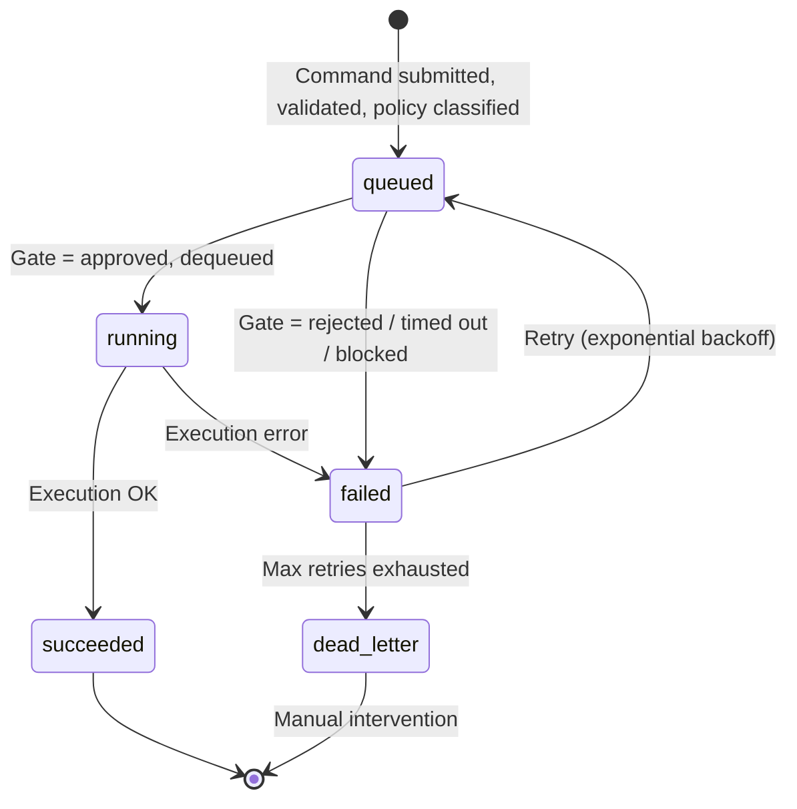

# Jarvis v2.1: Command-Control Spec

> **Version:** 2.1  
> **Status:** Draft  
> **Previous:** [Jarvis v2: Architecture & Operations Guide](./JARVIS_V2_ARCHITECTURE.md)  
> **Design patterns borrowed from:** Gatekeeper EOS v6 (lock order enforcement, checkpoint persistence, campaign schema)

---

## 1. Core Pipeline

```
Input → Orchestrator → LLM Parser → Schema Validator → Risk Policy → Queue → Execution → Audit
```

Each stage is a distinct responsibility with fail-closed semantics:

| Stage | Responsibility |
|-------|---------------|
| **Input** | Voice, phone shortcuts, widgets, web UI |
| **Cloud Orchestrator** | Make.com / n8n webhook routing (no business logic) |
| **LLM Parser** | One LLM translates natural language → structured JSON |
| **Schema Validator** | Rejects malformed or out-of-bounds commands before they reach any target |
| **Risk Policy** | Classifies every command into auto-approve, auto-approve+audit, always-confirm, or blocked |
| **Queue** | Assigns command IDs, retries on failure, preserves ordering |
| **Execution** | Home Assistant (HOME), BetterTouchTool/EventGhost (PC), future targets |
| **Audit** | Immutable log of every command, approval, and outcome |

---

## 2. Formal JSON Schema

### 2.1 Command Schema

```json
{
  "$schema": "http://json-schema.org/draft-07/schema#",
  "$id": "https://jarvis.local/schemas/command.schema.json",
  "title": "Jarvis Command",
  "description": "Strict JSON command protocol for Jarvis v2.1. All fields are whitelisted — unknown targets, actions, or parameter patterns are rejected before execution.",
  "type": "object",
  "required": ["target", "action", "parameter", "idempotency_key", "requested_at"],
  "additionalProperties": false,
  "properties": {
    "command_id": {
      "type": "string",
      "pattern": "^CMD-[a-zA-Z0-9]{8,16}$",
      "description": "Unique command identifier assigned by the queue. Optional on submission — auto-generated if omitted."
    },
    "source": {
      "type": "string",
      "enum": ["voice", "phone_shortcut", "widget", "web_ui", "routine", "api"],
      "description": "Origin of the command, used for audit and rate-limiting."
    },
    "target": {
      "type": "string",
      "enum": ["PC", "HOME"],
      "description": "Execution target. Expand this enum as new targets are added."
    },
    "action": {
      "type": "string",
      "description": "Action to perform on the target. Each target has a whitelist (see $ref)."
    },
    "parameter": {
      "type": "string",
      "maxLength": 512,
      "description": "Action parameter. Validated client-side against the target schema."
    },
    "priority": {
      "type": "integer",
      "minimum": 0,
      "maximum": 10,
      "default": 5,
      "description": "Queue priority. Higher values execute first. 0 = background, 10 = immediate."
    },
    "idempotency_key": {
      "type": "string",
      "pattern": "^IDEM-[a-f0-9]{32}$",
      "description": "Mandatory idempotency key for deduplication. Every queued command must include one. The queue drops duplicates within the TTL window."
    },
    "requested_at": {
      "type": "string",
      "format": "date-time",
      "description": "ISO 8601 timestamp when the command was requested by the user."
    }
  },
  "allOf": [
    { "$ref": "#/definitions/target_actions" }
  ],
  "definitions": {
    "target_actions": {
      "description": "Target-specific action whitelists. Each target enum value maps to a restricted set of actions.",
      "type": "object",
      "properties": {
        "target": true,
        "action": {
          "type": "string",
          "enum": []
        }
      }
    },
    "pc_actions": {
      "type": "string",
      "enum": ["LAUNCH_APP", "OPEN_URL", "EXECUTE_MACRO", "MEDIA_CONTROL", "LOCK_WORKSTATION", "SEND_KEYSTROKE", "RUN_SCRIPT", "DELETE_FILE", "SHUTDOWN_PC"],
      "description": "Allowed PC actions. Always-confirm actions: LOCK_WORKSTATION, SEND_KEYSTROKE, RUN_SCRIPT, DELETE_FILE, SHUTDOWN_PC."
    },
    "home_actions": {
      "type": "string",
      "enum": ["TURN_ON", "TURN_OFF", "SET_BRIGHTNESS", "SET_TEMPERATURE", "LOCK_DOOR", "UNLOCK_DOOR", "SET_SCENE", "DISABLE_ALARM"],
      "description": "Allowed HOME actions. Always-confirm actions: UNLOCK_DOOR, DISABLE_ALARM."
    },
    "risk_level": {
      "type": "string",
      "enum": ["low", "medium", "high"],
      "description": "Risk classification used by the approval engine."
    }
  }
}
```

### 2.2 Example Commands

**Safe — passes through without approval:**
```json
{
  "target": "PC",
  "action": "OPEN_URL",
  "parameter": "https://google.com"
}
```

**Risky — requires approval:**
```json
{
  "target": "PC",
  "action": "RUN_SCRIPT",
  "parameter": "rm -rf ~/Documents"
}
```

---

## 3. Risk Policy

### 3.1 Policy Table (Frozen)

The risk policy sits between the schema validator and the queue. Every action is classified into exactly one of four policies:

| Policy | Gate Behavior | Included Actions |
|--------|---------------|------------------|
| **Auto-approve** | Passes into the queue immediately. Audit log entry created but no confirmation required. | `OPEN_URL` (https only), `MEDIA_CONTROL`, `TURN_ON`, `TURN_OFF`, `SET_BRIGHTNESS`, `SET_SCENE`, `LOCK_DOOR` |
| **Auto-approve + Audit** | Passes through but logged at elevated detail. Used for actions that change state in observable ways. | `EXECUTE_MACRO`, `SET_TEMPERATURE`, `LAUNCH_APP` |
| **Always Confirm** | Requires explicit user confirmation before entering the queue. No auto-approve path. | `LOCK_WORKSTATION`, `DELETE_FILE`, `SHUTDOWN_PC`, `SEND_KEYSTROKE`, `RUN_SCRIPT`, `UNLOCK_DOOR`, `DISABLE_ALARM` |
| **Blocked** | Rejected at schema level. Cannot be queued at all. | (reserved for decommissioned or dangerous actions) |

### 3.2 Classification Rules

The final policy is determined by a combination of `action` and `parameter`. The strictest match wins:

```
Final policy = max(
    action_policy[command.action],
    parameter_policy(command.parameter)
)
```

**Action policy table:**

| Action | Policy |
|--------|--------|
| OPEN_URL | Auto-approve |
| MEDIA_CONTROL | Auto-approve |
| TURN_ON | Auto-approve |
| TURN_OFF | Auto-approve |
| SET_BRIGHTNESS | Auto-approve |
| SET_SCENE | Auto-approve |
| LOCK_DOOR | Auto-approve |
| EXECUTE_MACRO | Auto-approve + Audit |
| SET_TEMPERATURE | Auto-approve + Audit |
| LAUNCH_APP | Auto-approve + Audit |
| LOCK_WORKSTATION | Always Confirm |
| DELETE_FILE | Always Confirm |
| SHUTDOWN_PC | Always Confirm |
| SEND_KEYSTROKE | Always Confirm |
| RUN_SCRIPT | Always Confirm |
| UNLOCK_DOOR | Always Confirm |
| DISABLE_ALARM | Always Confirm |

**Parameter escalation rules** (override the action's default policy to **Always Confirm**):
- Contains shell metacharacters (`;`, `|`, `&&`, `` ` ``, `$()`)
- References paths outside whitelisted directories (e.g. `~/Documents`, `/tmp/*`)
- Action is `RUN_SCRIPT` and parameter is not a whitelisted script alias
- Action is `OPEN_URL` and URL scheme is not `https://`
- Action is `OPEN_URL` and URL contains an IP address or localhost

### 3.3 Gate Behavior

The policy gate is a binary outcome — it determines whether the command enters the queue or not. It is **not** a queue state.

```
┌──────────────┐
│  Command In  │
└──────┬───────┘
       ▼
┌──────────────────┐
│ Policy Classify  │
└──────┬───────────┘
       │
       ├── Auto-approve ────────► gate=approved ──► Queue (status=queued)
       │                              │
       ├── Auto-approve+Audit ────────► gate=approved ──► Audit ──► Queue (status=queued)
       │                              │
       ├── Always Confirm ────────────► Await confirmation
       │                                     │
       │                               ┌─────┴─────┐
       │                               ▼           ▼
       │                         ┌──────────┐  ┌────────────┐
       │                         │ Approved │  │ Rejected / │
       │                         └────┬─────┘  │ Timed Out  │
       │                              ▼        └──────┬─────┘
       │                         gate=approved        ▼
       │                              │          gate=rejected
       │                              ▼          status=failed
       │                         Queue               (log + discard)
       │                     (status=queued)
       │
       └── Blocked ───────────────────► gate=blocked ──► status=failed ──► Audit
```

**Confirmation delivery:** Push notification to the user's phone / desktop with command details and Approve/Reject buttons. Configurable timeout (default: 30 s). Commands that time out transition to `gate=rejected` / `status=failed` and are logged.

### 3.4 Gatekeeper-Originated Pattern: Lock Order Enforcement

Borrowing from Gatekeeper's `locks.py`:

> **Fail closed** — any policy classification failure (unknown action, unparseable parameter) defaults to **Always Confirm**.
>
> **Acquisition order** — locks are acquired in strict ascending order of `acquire_order`. For Jarvis, this maps to: commands that access shared resources (e.g., media playback + volume control) must acquire them in a defined order to prevent race conditions.

---

## 4. Action Queue

### 4.1 Canonical Status Model

Every command progresses through exactly one of five canonical queue states. The approval gate is a **binary outcome** external to the queue — it determines whether a command enters the queue (`gate=approved`) or transitions to `failed` (`gate=rejected` / `gate=blocked`).



| Status | Meaning |
|--------|---------|
| `queued` | Submitted, validated, gate passed, waiting in priority queue |
| `running` | Currently being executed by the receiver |
| `succeeded` | Executed successfully |
| `failed` | Execution failed, or gate outcome was rejected/timed out/blocked. May be retried. |
| `dead_letter` | Exhausted all retries. Requires manual inspection. |

### 4.2 Queue Structure

Each queued command is a record with the following fields:

| Field | Type | Description |
|-------|------|-------------|
| `command_id` | `string` | Unique ID (`CMD-` + 8-16 alphanumeric chars) |
| `source` | `string` | Origin (voice, web_ui, routine, etc.) |
| `target` | `string` | Execution target |
| `action` | `string` | Action name |
| `parameter` | `string` | Action parameter |
| `priority` | `int` (0–10) | Queue priority (higher = sooner) |
| `idempotency_key` | `string` | **Mandatory** dedup key (pattern: `^IDEM-[a-f0-9]{32}$`) |
| `status` | `string` | One of: `queued`, `running`, `succeeded`, `failed`, `dead_letter` |
| `policy` | `string` | Classified policy: `auto-approve`, `auto-approve-audit`, `always-confirm`, `blocked` |
| `gate` | `string` | Gate outcome: `approved`, `rejected`, `timed_out`, `blocked`. Null until classified. |
| `retry_count` | `int` | Number of retry attempts (0 = first attempt) |
| `max_retries` | `int` | Max retries before `dead_letter` (default: 3) |
| `created_at` | `string` (ISO 8601) | Submission timestamp |
| `requested_at` | `string` (ISO 8601) | Original request timestamp from command |
| `started_at` | `string` (ISO 8601) | Execution start timestamp |
| `completed_at` | `string` (ISO 8601) | Execution end timestamp |
| `error` | `string` | Last error message (if failed) |
| `result_hash` | `string` | SHA-256 of the execution result (integrity check) |

### 4.3 Queue Semantics

- **FIFO within priority level.** Higher-priority commands (lower number = higher priority) are dequeued first.
- **Idempotency:** Every command **must** include an `idempotency_key`. If a command with the same key is received within the TTL window (60 s), the duplicate is dropped and the existing record's status is returned.
- **Retry policy:** Exponential backoff: `2^retry_count` seconds, capped at 60 s. Max 3 retries. Retry transitions: `failed → queued`.
- **Dead letter:** Commands that exhaust retries transition to `dead_letter` for manual inspection.
- **Ordering guarantees:** Commands from the same `source` with the same `target` are executed in submission order. No ordering guarantees across different sources or targets.

### 4.4 Queue Storage

Persisted to local SQLite (PC-side) or cloud database. The queue is reloaded on receiver restart so no in-flight commands are lost.

```sql
CREATE TABLE action_queue (
    command_id       TEXT PRIMARY KEY,
    source           TEXT NOT NULL,
    target           TEXT NOT NULL,
    action           TEXT NOT NULL,
    parameter        TEXT NOT NULL,
    priority         INTEGER DEFAULT 5,
    idempotency_key  TEXT NOT NULL UNIQUE,
    requested_at     TEXT NOT NULL,
    status           TEXT NOT NULL DEFAULT 'queued'
                     CHECK (status IN ('queued','running','succeeded','failed','dead_letter')),
    policy           TEXT NOT NULL DEFAULT 'auto-approve'
                     CHECK (policy IN ('auto-approve','auto-approve-audit','always-confirm','blocked')),
    gate             TEXT
                     CHECK (gate IS NULL OR gate IN ('approved','rejected','timed_out','blocked')),
    retry_count      INTEGER DEFAULT 0,
    max_retries      INTEGER DEFAULT 3,
    created_at       TEXT DEFAULT (datetime('now')),
    started_at       TEXT,
    completed_at     TEXT,
    error            TEXT,
    result_hash      TEXT
);
```

### 4.5 Borrowed Pattern: Checkpoint Resume

From Gatekeeper's `checkpoint.py`:

> **Session persistence** — each queued command maintains a checkpoint of its state. If the receiver crashes mid-execution, the queue reloads checkpoints on restart and resumes or retries commands in `running` status.
>
> **Rollback** — if a multi-step routine fails midway, the queue can issue compensating commands (e.g., if "Movie Time" dims lights but the TV fails to turn on, the queue can restore lights to their previous brightness).

---

## 5. Audit Log

### 5.1 Log Structure

Every command lifecycle event is recorded to an append-only audit log:

```
{timestamp} | {event_type} | {command_id} | {target}:{action} | {status} | {detail}
```

**Event types** (aligned to the canonical status model):
- `COMMAND_SUBMITTED`
- `COMMAND_VALIDATED`
- `COMMAND_REJECTED_SCHEMA`
- `COMMAND_POLICY_CLASSIFIED`
- `APPROVAL_REQUESTED`
- `APPROVAL_GRANTED`
- `APPROVAL_REJECTED`
- `APPROVAL_TIMED_OUT`
- `COMMAND_QUEUED`
- `COMMAND_DEQUEUED`
- `COMMAND_EXECUTING`
- `COMMAND_SUCCEEDED`
- `COMMAND_FAILED`
- `COMMAND_RETRYING`
- `COMMAND_DEAD_LETTER`
- `COMMAND_ROLLED_BACK`

### 5.2 Storage

Audit logs are stored in two tiers:

| Tier | Storage | Retention | Purpose |
|------|---------|-----------|---------|
| **Hot** | Local file (rotated daily) | 30 days | Recent debugging and operational visibility |
| **Cold** | Cloud bucket (S3-compatible) | 1 year | Compliance and post-mortem analysis |

### 5.3 Integrity

Each audit log entry includes a SHA-256 hash of the previous entry, forming a hash chain:

```
entry[n] = { timestamp, event, command_id, detail, prev_hash: entry[n-1].hash, hash: sha256(...) }
```

This makes the log tamper-evident — any modification breaks the chain.

### 5.4 Sample Traces

**Auto-approved command (low risk):**
```
2026-06-11T08:15:00Z | COMMAND_SUBMITTED       | CMD-a1b2c3d4 | HOME:TURN_ON        | queued    | IDEM-abc..., source=voice, param=living_room_lamp
2026-06-11T08:15:00Z | COMMAND_VALIDATED        | CMD-a1b2c3d4 | HOME:TURN_ON        | queued    | schema ok
2026-06-11T08:15:00Z | COMMAND_POLICY_CLASSIFIED | CMD-a1b2c3d4 | HOME:TURN_ON        | approved  | policy=auto-approve
2026-06-11T08:15:01Z | COMMAND_DEQUEUED         | CMD-a1b2c3d4 | HOME:TURN_ON        | running   |
2026-06-11T08:15:02Z | COMMAND_EXECUTING        | CMD-a1b2c3d4 | HOME:TURN_ON        | running   | target=192.168.1.100:8123
2026-06-11T08:15:03Z | COMMAND_SUCCEEDED        | CMD-a1b2c3d4 | HOME:TURN_ON        | succeeded | result=success
```

**Always-confirm command rejected by user:**
```
2026-06-11T08:20:00Z | COMMAND_SUBMITTED       | CMD-e5f6g7h8 | PC:RUN_SCRIPT       | queued    | IDEM-def..., source=web_ui
2026-06-11T08:20:00Z | COMMAND_VALIDATED        | CMD-e5f6g7h8 | PC:RUN_SCRIPT       | queued    | schema ok
2026-06-11T08:20:00Z | COMMAND_POLICY_CLASSIFIED | CMD-e5f6g7h8 | PC:RUN_SCRIPT       | queued    | policy=always-confirm
2026-06-11T08:20:00Z | APPROVAL_REQUESTED       | CMD-e5f6g7h8 | PC:RUN_SCRIPT       | queued    | sent push notification
2026-06-11T08:20:05Z | APPROVAL_REJECTED        | CMD-e5f6g7h8 | PC:RUN_SCRIPT       | failed    | rejected by user
```

**Command that exhausted retries:**
```
2026-06-11T08:25:00Z | COMMAND_SUBMITTED       | CMD-i9j0k1l2 | HOME:SET_TEMPERATURE | queued    | IDEM-ghi...
2026-06-11T08:25:01Z | COMMAND_DEQUEUED         | CMD-i9j0k1l2 | HOME:SET_TEMPERATURE | running   |
2026-06-11T08:25:05Z | COMMAND_FAILED           | CMD-i9j0k1l2 | HOME:SET_TEMPERATURE | failed    | connection timeout
2026-06-11T08:25:06Z | COMMAND_RETRYING         | CMD-i9j0k1l2 | HOME:SET_TEMPERATURE | queued    | attempt 1/3, backoff=2s
2026-06-11T08:25:08Z | COMMAND_DEQUEUED         | CMD-i9j0k1l2 | HOME:SET_TEMPERATURE | running   |
2026-06-11T08:25:12Z | COMMAND_FAILED           | CMD-i9j0k1l2 | HOME:SET_TEMPERATURE | failed    | connection timeout (x3)
2026-06-11T08:25:12Z | COMMAND_DEAD_LETTER      | CMD-i9j0k1l2 | HOME:SET_TEMPERATURE | dead_letter | max retries exhausted
```

---

## 6. Standard Routines (Updated)

Routines are pre-approved sequences of commands with rollback support. Each routine defines a list of commands, their dependencies, and a compensating action for each step.

```json
{
  "routine_id": "ROUTINE-start-workday",
  "name": "Start My Workday",
  "risk_level": "low",
  "commands": [
    {
      "target": "HOME",
      "action": "TURN_ON",
      "parameter": "desk_lamp",
      "compensation": { "action": "TURN_OFF", "parameter": "desk_lamp" }
    },
    {
      "target": "PC",
      "action": "LAUNCH_APP",
      "parameter": "Slack",
      "depends_on": null
    },
    {
      "target": "PC",
      "action": "OPEN_URL",
      "parameter": "https://calendar.google.com",
      "depends_on": null
    }
  ]
}
```

| Routine | Commands | Compensation |
|---------|----------|-------------|
| **Start My Workday** | Desk lamp on → Slack launch → Calendar open | Turn off lamp |
| **Movie Time** | Dim lights (50%) → Turn on TV → Mute PC | Restore lights to 100% |
| **I’m Leaving** | Lights off → Thermostat to eco → Lock workstation | None (no-op) |

---

## 7. Safety Rules (Updated for v2.1)

1. **Fail closed.** Any schema validation failure, unknown action, or unparseable parameter defaults to rejection with log entry.
2. **Token-gated receivers.** Every local receiver requires a bearer token or custom header. Token is set at deploy time and rotated quarterly.
3. **Short delay between chained commands.** 500 ms minimum between PC commands in a routine to prevent race conditions.
4. **Tunnels preferred.** Use Cloudflare Tunnel or Tailscale Funnel instead of port-forwarding. Never expose raw local ports to the internet.
5. **Test webhooks manually** before enabling full automation. Use the sandbox endpoint to dry-run commands without execution.
6. **Always-confirm policy enforced for high-risk actions.** Confirmation must come from the same user session or a pre-configured trusted device. 30-second timeout. No bypass path.
7. **Idempotency_key is mandatory.** Every queued command must include a valid `idempotency_key` (pattern: `^IDEM-[a-f0-9]{32}$`). The queue enforces a 60-second dedup window. Commands without one are rejected at schema validation.
8. **Max retries = 3.** Exponential backoff. Dead-letter queue for permanent failures.

---

## 8. Troubleshooting (Updated for v2.1)

```
Command failed
        │
        ▼
  ┌──────────────────────────┐
  │ 1. Check audit log       │ ← First stop: find the command_id and trace
  └──────────────────────────┘
        │
        ▼
  ┌──────────────────────────┐
  │ 2. Schema valid?         │ ← If rejected at validation: check target/action/parameter
  └──────────────────────────┘
        │
        ▼
  ┌──────────────────────────┐
  │ 3. Approval status?      │ ← If pending/timed_out: approval never came
  └──────────────────────────┘
        │
        ▼
  ┌──────────────────────────┐
  │ 4. Queue status?         │ ← If still queued: check priority/dead-letter
  └──────────────────────────┘
        │
        ▼
  ┌──────────────────────────┐
  │ 5. Receiver reachable?   │ ← Confirm endpoint + port + token
  └──────────────────────────┘
        │
        ▼
  ┌──────────────────────────┐
  │ 6. Packet inspection     │ ← Last resort: only if request reaches system
  └──────────────────────────┘      but action still fails
```

### Quick diagnostic commands (proposed for `jarvisctl`):

| Command | What it does |
|---------|-------------|
| `jarvisctl queue ls` | List pending and in-flight commands |
| `jarvisctl queue flush <command_id>` | Remove a stuck command |
| `jarvisctl queue retry <command_id>` | Force a retry |
| `jarvisctl audit tail [-n 50]` | Show recent audit log entries |
| `jarvisctl audit get <command_id>` | Show full trace for a command |
| `jarvisctl status` | Show system health (queue depth, receiver status, log integrity) |

---

## 9. Expansion Notes (Updated)

- **Keep the JSON schema whitelisted.** Every new target, action, or parameter pattern must be added explicitly — never use a catch-all.
- **Add approval gates for risky actions first.** The approval engine should be extended before new targets are added.
- **Queue-first design.** All commands go through the queue, even if they execute immediately. This ensures retries, logging, and ordering.
- **Audit log hash chain.** Essential for tamper-evident logging. Implement early — retrofitting is painful.
- **New targets** (Android, NAS, Tesla, etc.) require:
  1. Add target enum value to schema
  2. Add action whitelist
  3. Classify risk levels for each action
  4. Implement receiver with token auth
  5. Add to `jarvisctl status` health check
- **Wireshark / packet-forensics material** — kept in a separate appendix (`FORENSICS.md`), not in this spec.

---

## 10. Implementation Phases

| Phase | Scope | Dependencies |
|-------|-------|-------------|
| **Phase 1** | JSON Schema + Validator + Audit Log | None |
| **Phase 2** | Action Queue (SQLite) + Retry + Dedup | Phase 1 |
| **Phase 3** | Risk Policy + Notification Delivery | Phase 2 |
| **Phase 4** | Routine Runner + Compensation/Rollback | Phase 3 |
| **Phase 5** | `jarvisctl` CLI + Health Checks | Phase 4 |
| **Phase 6** | New Targets (Android, NAS, Tesla) | Phase 5 |

---
